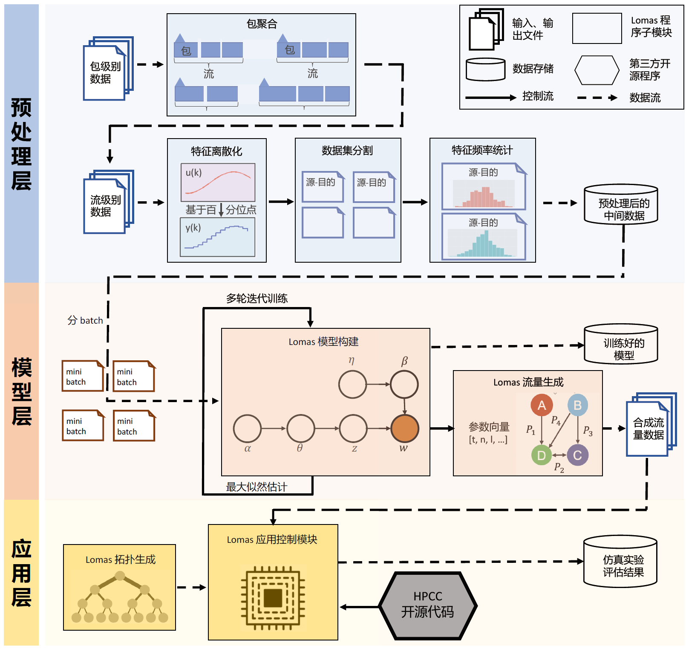

Lomas tutorial
=======================================

The prototype source code of the paper:

*Locality Matters! Traffic Demand Modeling in Datacenter Networks* (Best Student Paper Award)

Zhiwen Liu (Maintainer), Mowei Wang, Yong Cui

the 6th Asia-Pacific Workshop on Networking (APNet 2022).

Read the tutorial here:

https://lomas-tutorial.readthedocs.io/zh/latest/

How to use
----------------------------------------

.. code-block:: python

  from lomas.preprocessor import Preprocessor
  from lomas.generator import Generator
  
  def main(config):
      # Preprocessing. define the file path and file name of the raw data
      data = Preprocessor(f_path=config['path'], 
                          f_name=config['filenames'], 
                          f_type=config['type'],
                          column_names=config['cols'])
      # Initialization. init Lomas model using the preprocessed data
      model = Generator(ip_id_dict=data.ip_id_dict, 
                         ordered_ippair=data.ordered_ippair, 
                         cdf_iat=data.cdf_iat, 
                         cdf_size=data.cdf_size)
      model.initialize(data.trace_input)
      # Hyperparameters setting. set the hyperparameters of Lomas model, and train the model
      model.train(num_topics=25, 
                  chunksize=2000, 
                  passes=20, 
                  iterations=400)
      # Generation. generate synthetic trace by iteratively sampling from Lomas model
      model.generate(time_limit=data.trace_input['ts'].max(), 
                     time_unit=config['ts_unit'])
  # Running 
  if __name__ == "__main__":
      main(config)

System architecture
---------------------------------------- 

The architecture of Lomas:

